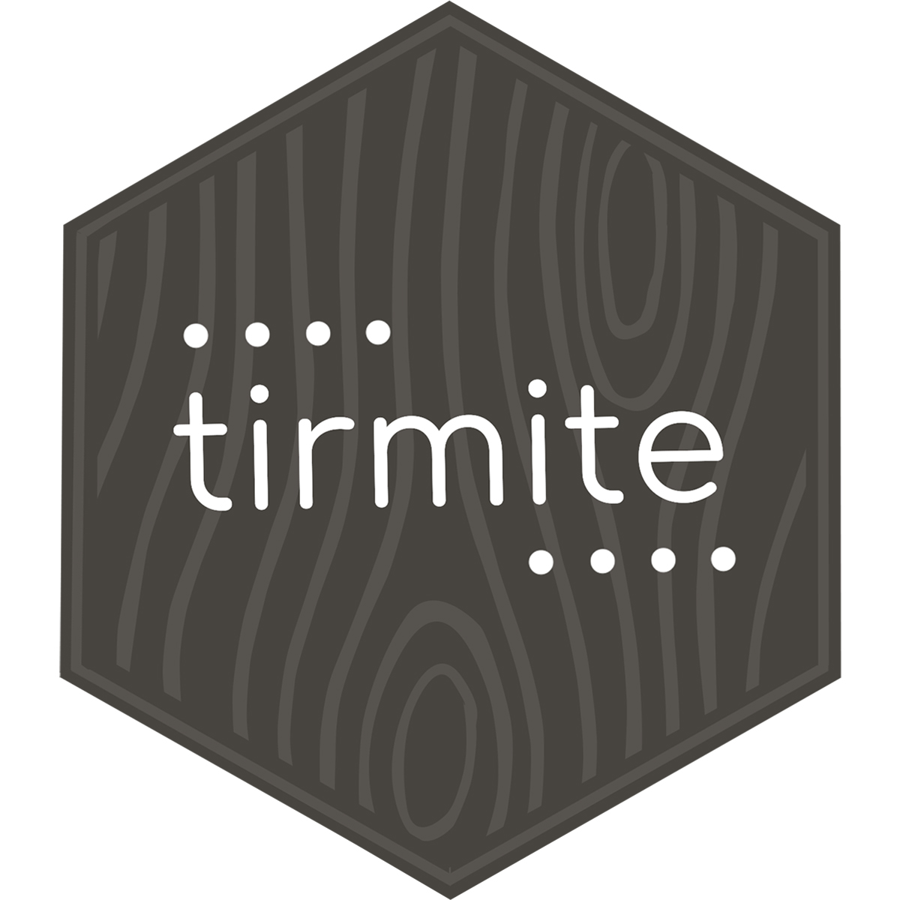
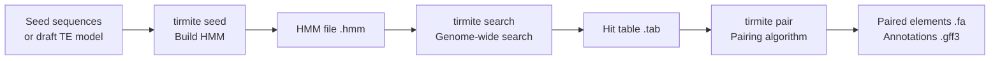

# TIRmite

<p align="center">

</p>

[](https://www.gnu.org/licenses/gpl-3.0)
[](https://badge.fury.io/py/TIRmite)
[](http://bioconda.github.io/recipes/tirmite/README.html)

**TIRmite** employs profile Hidden Markov Models (HMMs) to model natural variation in transposon termini and recover divergent and degraded hits that are often missed by sequence-based aligners like BLAST.

## About TIRmite

Autonomous examples of transposons, belonging to many distinct super-families, share two common properties: a gene or genes encoding the mode of transposition; and terminal sequence features that are recognised by these gene products as the element boundaries.

MITEs are a classic example of non-autonomous structural variants — derived from autonomous DNA elements with Terminal Inverted Repeats (TIRs), they are Miniature Inverted-repeat Transposable Elements, sometimes little more than a pair of TIRs.

When non-autonomous structural variants of a TE vastly outnumber their parent element, and include forms that capture novel genes or other full transposons, it becomes difficult to correctly cluster related elements based on the limited signal present in terminal sequences (TIRs, LTRs, etc.).

TIRmite will use profile-HMM models of Transposon Terminal Repeats for genome-wide annotation of transposon families. You can search for TE families with:

- **Symmetrical termini** (i.e. TIRs or LTRs) — the same HMM model hits both ends of the element
- **Asymmetrical termini** (i.e. Helitrons, Helentrons, and Starship elements) — different HMM models describe each end

## Why Use HMMs Instead of Simple BLAST?

When searching for transposon termini across a genome, you have several options:

| Approach | Pros | Cons |
|----------|------|------|
| Single BLAST query | Simple, fast | Misses divergent/degraded copies; sensitive to query choice |
| Ensemble of BLAST queries, then cluster | Better coverage | Still limited by sequence identity; complex pipeline |
| Profile HMM (TIRmite) | Captures natural variation; detects degenerate copies; single model per terminus | Requires curating seed alignment |

Profile HMMs capture the full spectrum of sequence variation across all known instances of a terminus, not just a single representative. This means:

1. **More sensitive detection** — divergent copies with low identity to any single seed are still found
2. **Fewer false negatives** — degraded MITEs and cryptic variants are recovered
3. **Single model per terminus class** — no need to manage dozens of BLAST queries; one HMM per terminus type
4. **Probabilistic scoring** — each hit is scored against the full conservation profile, not just identity to one sequence

When you have an ensemble of related termini sequences, clustering them first (e.g. to 80% identity with MMseqs2) and building one HMM per cluster lets you distinguish sub-types while still benefiting from the sensitivity of HMM-based search.

## Three Output Classes

Three classes of output are produced:

1. All significant termini hit sequences are written to FASTA (per query HMM).
2. Candidate elements comprised of paired termini are written to FASTA (per query HMM).
3. Genomic annotations of candidate elements and, optionally, HMM hits (paired and unpaired) are written as a single GFF3 file.

## Workflow Overview



## Installation

TIRmite requires Python >= v3.9

**External dependencies:**

- [HMMER3](http://hmmer.org) — `nhmmer` for HMM-based genome search
- [mafft](https://mafft.cbrc.jp/alignment/software/) — multiple sequence alignment for HMM building
- [BLAST+](https://ftp.ncbi.nlm.nih.gov/blast/executables/blast+/LATEST/) (Optional) — alternative search method

### Conda (recommended)

```bash
# Create environment with all dependencies
conda env create -f environment.yml
conda activate tirmite
```

### From Bioconda

```bash
conda install -c bioconda tirmite
```

### From PyPI

```bash
pip install tirmite
```

### Development install

```bash
git clone https://github.com/Adamtaranto/TIRmite.git && cd TIRmite
conda env create -f environment.yml
conda activate tirmite
pip install -e '.[dev]'
pre-commit install
```

### Test installation

```bash
# Print version number and exit
tirmite --version

# Get usage information
tirmite --help
```

## Quick Start

```bash
# 1. Build a pHMM from seed sequences
tirmite seed \
  --left-seed tsplit_results/TIR_element_tsplit_output.fasta \
  --model-name MY_TIR \
  --outdir MY_TIR_HMM \
  --genome genome.fa \
  --threads 8

# 2. Search the genome with nhmmer
nhmmer --dna --cpu 8 --tblout MY_TIR_nhmmer_hits.tab MY_TIR_HMM/MY_TIR.hmm genome.fa

# 3. Pair the hits and annotate elements
tirmite pair \
  --genome genome.fa \
  --nhmmer-file MY_TIR_nhmmer_hits.tab \
  --hmm-file MY_TIR_HMM/MY_TIR.hmm \
  --orientation F,R \
  --mincov 0.4 \
  --maxdist 20000 \
  --outdir MY_TIR_OUTPUT \
  --gff
```

## Subcommands

| Command | Description |
|---------|-------------|
| `tirmite seed` | Build HMM models from seed sequences using BLAST to find instances in a genome |
| `tirmite search` | Ensemble search: run BLAST/nhmmer and merge hits from clustered features |
| `tirmite pair` | Pair precomputed nhmmer or BLAST hits using the pairing algorithm |
| `tirmite legacy` | Original TIRmite workflow (HMM search + pairing, all-in-one) |

## Tutorials

- [Building HMMs for Transposon Termini](tutorials/building-hmms.md) — How to use `tirmite seed` to build HMM models from seed sequences
- [Using tirmite search](tutorials/tirmite-search.md) — How to use `tirmite search` for ensemble genome searching
- [Using tirmite pair](tutorials/tirmite-pair.md) — How to use `tirmite pair` to annotate candidate transposon elements

## Contributing

See the [contribution guidelines](https://github.com/Adamtaranto/TIRmite/blob/main/.github/CONTRIBUTING.md).

## License

Software provided under [GPL-3 license](https://www.gnu.org/licenses/gpl-3.0).
