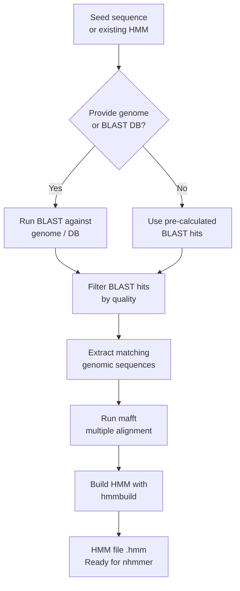

# Building HMMs for Transposon Termini

This tutorial walks you through using `tirmite seed` to construct profile Hidden Markov Models (pHMMs) from seed sequences, which you then use for genome-wide transposon discovery.

## Overview

`tirmite seed` automates the following workflow:



### Symmetrical vs Asymmetrical Termini

Most DNA transposons have **symmetrical termini** — the same sequence feature (e.g. a TIR) appears at both ends, just on opposite strands. For these, you only need one seed sequence (or one HMM), and TIRmite pairs hits from the same model in forward and reverse orientation.

Some elements have **asymmetrical termini** — the left and right ends are conserved but distinct from one another (e.g. Helitrons, Helentrons, Starship elements). For these, you need separate seeds (and separate HMM models) for each end. You then tell TIRmite which left model pairs with which right model.

| Element type | Terminus type | Orientation pairing |
|-------------|---------------|---------------------|
| TIR elements, MITEs | Symmetric TIR | `F,R` — same model |
| LTR retrotransposons | Symmetric LTR | `F,F` — same model |
| Helitrons, Starships | Asymmetric | `F,R` — left model + right model |

## Step 1: Identify Your Seed Sequences

### Option A: Extract TIRs with tSplit (recommended)

If you have a draft TE model (e.g. from RepeatModeler or EDTA), use [tSplit](https://github.com/Adamtaranto/TE-splitter/) to extract terminal repeats:

```bash
# Extract TIRs from a sample element using BLASTn
# Minimum 40% identity, minimum 10 bp terminal length
tsplit TIR \
  -i TIR_element.fa \
  -d tsplit_results \
  --minid 0.4 \
  --method blastn \
  --minterm 10 \
  --splitmode external
```

This produces an oriented FASTA file where TIRs are presented 5′→3′ from the lefthand end.

!!! tip "TIR orientation convention"
    TIRs should always be oriented 5′→3′ with the lefthand TIR. For example, if both TIRs begin with "GA":

    ```
    5′  GA>>>>>>>  ATGC  <<<<<<<TC  3′
    3′  CT>>>>>>>>  TACG  <<<<<<<AG  5′
    ```

### Option B: Manually provide seeds for asymmetrical elements

For Helitrons, Starships, or other elements with distinct left and right ends, provide separate FASTA files for each terminus:

```bash
# left_terminus.fa — sequences representing the 5′ end
# right_terminus.fa — sequences representing the 3′ end
```

!!! note "Asymmetric seed orientation"
    For asymmetric elements, orient the **left seed** in the same direction as the element (5′ to 3′), and the **right seed** as it appears on the positive strand at the 3′ end of the element.

## Step 2: Run `tirmite seed`

### Basic usage — single seed, search a genome

```bash
GENOME="genome.fa"

tirmite seed \
  --left-seed tsplit_results/TIR_element_tsplit_output.fasta \
  --model-name MY_TIR \
  --outdir MY_TIR_HMM \
  --genome $GENOME \
  --max-gap 10 \
  --save-blast-hits \
  --threads 8
```

Key options:

| Option | Description |
|--------|-------------|
| `--left-seed` | FASTA file with seed sequence(s) for the left/symmetric terminus |
| `--right-seed` | FASTA file with seed sequence(s) for the right terminus (asymmetric only) |
| `--model-name` | Name for the output HMM model |
| `--genome` | Path to target genome FASTA (can specify multiple files) |
| `--outdir` | Output directory |
| `--max-gap` | Maximum allowed internal gap in BLAST hits |
| `--flank-size` | Add N bp of flanking sequence outside each hit (useful for checking truncation) |
| `--save-blast-hits` | Save the raw BLAST hits to file |
| `--threads` | Number of CPU threads for BLAST |

!!! tip "Check flanking sequence"
    Set `--flank-size 10` to add 10 bp flanks outside the TIR region. Conservation in the flank across many independent insertions may indicate your seed was truncated. Always inspect and adjust the seed as needed.

### With an existing HMM — update/extend the model

If you already have an HMM and want to update it with additional sequences from a new genome:

```bash
tirmite seed \
  --left-seed existing_seed.fa \
  --hmm-file existing_model.hmm \
  --model-name MY_TIR_updated \
  --genome new_genome.fa \
  --outdir MY_TIR_HMM_v2 \
  --threads 8
```

### With a prebuilt BLAST database

If you have already formatted a BLAST database, pass it with `--blastdb`:

```bash
# Create BLAST database (with parsed sequence IDs for direct extraction)
makeblastdb -in $GENOME -dbtype nucl -out genome_db -parse_seqids

tirmite seed \
  --left-seed seed.fa \
  --model-name MY_TIR \
  --blastdb genome_db \
  --outdir MY_TIR_HMM \
  --threads 8
```

### With pre-calculated BLAST hits

If you have already run BLAST and want to skip the search step:

```bash
# Run BLAST yourself (format 6 with extra fields for length info)
blastn \
  -query seed.fa \
  -db genome_db \
  -outfmt "6 qseqid sseqid pident length mismatch gapopen qstart qend sstart send evalue bitscore qlen slen" \
  -out my_blast_hits.tab \
  -evalue 0.001

# Pass pre-calculated hits to tirmite seed
tirmite seed \
  --left-seed seed.fa \
  --model-name MY_TIR \
  --blast-file my_blast_hits.tab \
  --genome $GENOME \
  --outdir MY_TIR_HMM
```

### Asymmetric termini — separate left and right seeds

```bash
tirmite seed \
  --left-seed left_terminus.fa \
  --right-seed right_terminus.fa \
  --model-name MY_ELEMENT \
  --genome $GENOME \
  --outdir MY_ELEMENT_HMM \
  --threads 8
```

This produces two HMM files:
- `MY_ELEMENT_LEFT.hmm` — model for the left terminus
- `MY_ELEMENT_RIGHT.hmm` — model for the right terminus

## Step 3: Inspect and Curate the Output Alignment

Before finalising your HMM, always inspect the multiple sequence alignment used to build it. The alignment file is saved in the output directory as `<model-name>_aligned.fa` (or similar).

### Inspect alignment with AliView

[AliView](https://ormbunkar.se/aliview/) is a fast alignment viewer:

```bash
aliview MY_TIR_HMM/MY_TIR_aligned.fa
```

Look for:
- Sequences that appear highly divergent (may be misaligned or false positives)
- Columns that are mostly gaps (consider trimming)
- Signs of truncation at the ends (review `--flank-size` output)

### Remove duplicate sequences with seqkit

Exact duplicates inflate apparent conservation. Remove them before building the final HMM:

```bash
# Install seqkit if needed: conda install -c bioconda seqkit
seqkit rmdup -s MY_TIR_HMM/MY_TIR_aligned.fa > MY_TIR_dedup.fa
```

### Cluster to 80% identity with MMseqs2 (for sub-type separation)

If your seed hits represent multiple distinct sub-types, cluster them before building separate HMMs:

```bash
# Cluster sequences at 80% identity
mmseqs easy-cluster \
  MY_TIR_HMM/MY_TIR_blast_hits.fa \
  MY_TIR_clusters \
  /tmp/mmseqs_tmp \
  --min-seq-id 0.8 \
  --cov-mode 0 \
  -c 0.8

# Representative sequences are in MY_TIR_clusters_rep_seq.fasta
# Cluster membership is in MY_TIR_clusters_cluster.tsv
```

For each cluster representative, build a separate HMM to capture each sub-type.

### Build HMM from a curated alignment with HMMER

After curation, you can rebuild the HMM directly with HMMER tools:

```bash
# Re-align with mafft (if you added/removed sequences)
mafft --auto MY_TIR_curated.fa > MY_TIR_curated_aligned.fa

# Build HMM with hmmbuild
hmmbuild MY_TIR_curated.hmm MY_TIR_curated_aligned.fa

# Press the HMM for nhmmer
hmmpress MY_TIR_curated.hmm
```

## Output Files

After running `tirmite seed`, the output directory contains:

| File | Description |
|------|-------------|
| `<model-name>.hmm` | Profile HMM ready for use with `nhmmer` or `tirmite search` |
| `<model-name>_aligned.fa` | Multiple sequence alignment used to build the HMM |
| `<model-name>_blast_hits.fa` | Raw hit sequences from BLAST (if `--save-blast-hits`) |
| `<model-name>_blast_hits.tab` | BLAST tabular output (if `--save-blast-hits`) |

## Next Steps

Once you have your HMM(s):

- → **[Using tirmite search](tirmite-search.md)** — Run genome-wide search with your HMM
- → **[Using tirmite pair](tirmite-pair.md)** — Pair hits and annotate candidate elements
