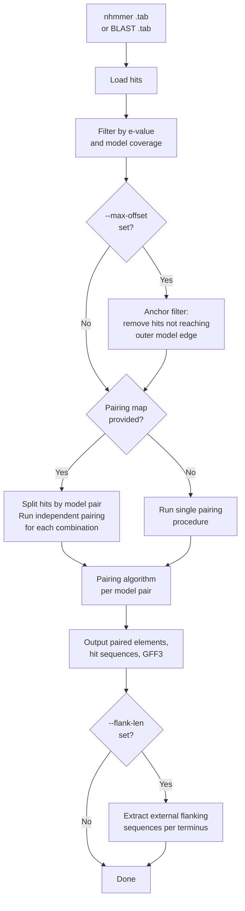
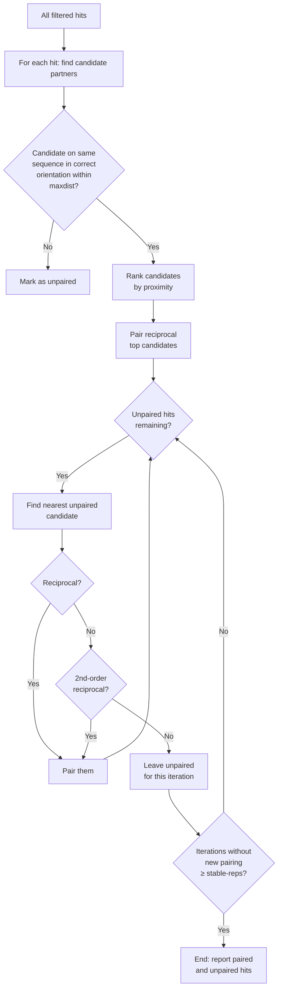
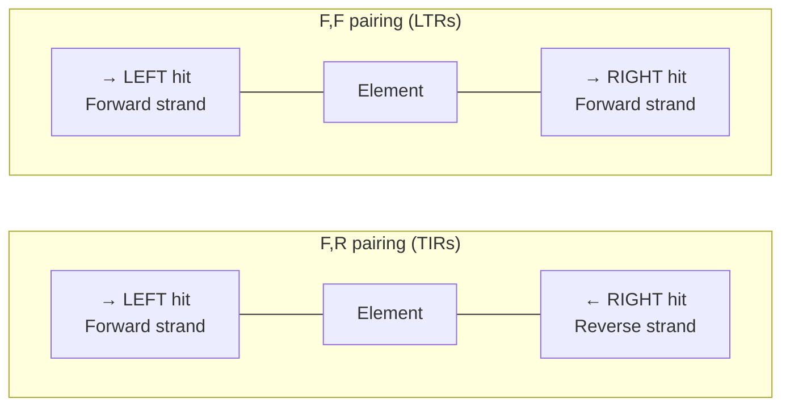
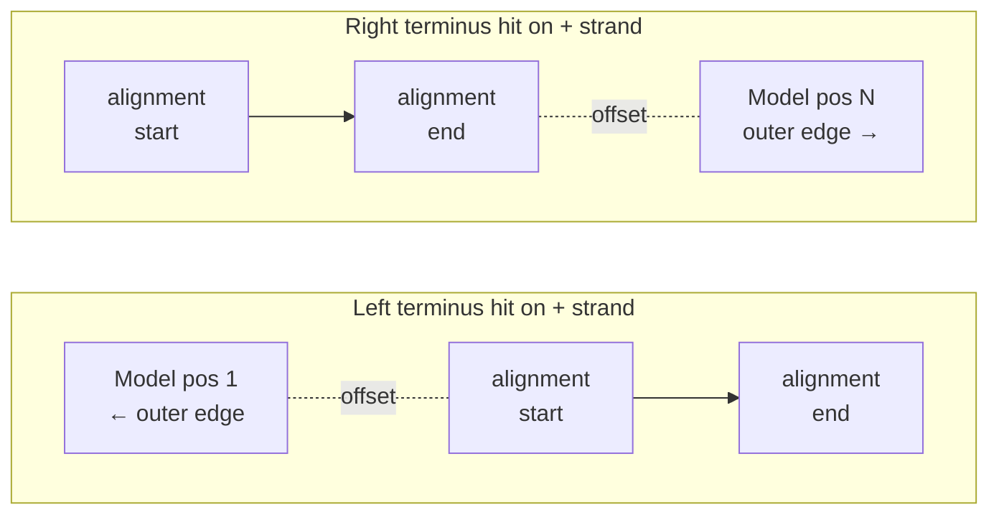

# Using tirmite pair

`tirmite pair` takes precomputed nhmmer or BLAST search results and applies the TIRmite pairing algorithm to identify valid transposon termini pairs. It outputs paired elements, hit sequences, and GFF3 annotations.

## Overview



## Input Types

`tirmite pair` accepts three types of hit input:

| Input flag | Format | Description |
|-----------|--------|-------------|
| `--nhmmer-file` | nhmmer tabular (`--tblout`) | Results from nhmmer search |
| `--blast-file` | BLAST tabular (`-outfmt 6`) | Results from blastn or megablast |
| Pre-filtered results | Either format | Output from `tirmite search` can be passed directly |

### When is the HMM file required?

Provide `--hmm-file` when using nhmmer input and you want TIRmite to calculate hit **coverage** (the fraction of the model that the hit spans). This requires knowing the model length, which is read directly from the HMM file.

If you don't have the HMM file, you can provide `--lengths-file` with a tab-delimited file mapping model names to their lengths.

### When is the lengths file required?

Provide `--lengths-file` when:

- Your input contains hits from **multiple models** but you don't have HMM files for all of them
- You are using BLAST input and want coverage filtering (BLAST doesn't record query lengths in the hit table)
- You have pre-filtered results from `tirmite search` where the original HMM is no longer accessible

Format of the lengths file (tab-delimited, one model per line):

```
# model_name    model_length
MY_TIR    150
LEFT_TERMINUS    120
RIGHT_TERMINUS    135
```

## The Pairing Algorithm

The pairing algorithm identifies the most parsimonious set of valid terminus pairs. The core logic iterates through unpaired hits and attempts to find a valid partner:



### Algorithm steps

1. Use nhmmer (or BLAST) to query genome with termini models/sequences.
2. Import all hits under `--maxeval` threshold.
3. For each significant terminus match, identify candidate partners, where:
   - Hit is on the same sequence
   - Hit is in correct relative orientation
   - Distance is ≤ `--maxdist`
   - Hit length is ≥ (model/query length × `--mincov`)
4. Rank candidate partners by distance downstream of positive-strand hits, and upstream of negative-strand hits.
5. Pair reciprocal top candidate hits.
6. For unpaired hits, find nearest unpaired candidate partner and check for reciprocity.
7. If the first unpaired candidate is non-reciprocal, check for 2nd-order reciprocity (is the outbound top-candidate of the current candidate reciprocal?).
8. Iterate steps 6–7 until all termini hits are paired OR number of iterations without a new pairing exceeds `--stable-reps`.

### Orientation settings

The `--orientation` flag controls which strand combinations are considered valid pairs:

| Setting | Meaning | Use case |
|---------|---------|----------|
| `F,R` | Forward hit paired with Reverse hit | TIR elements (same model) |
| `F,F` | Forward hit paired with Forward hit | LTR retrotransposons |
| `R,F` | Reverse hit paired with Forward hit | Rarely used |
| `R,R` | Reverse hit paired with Reverse hit | Rarely used |

For **asymmetric elements** using a pairing map, the orientation is applied independently for each left/right model pair defined in the pairing map.



## Examples

### Basic usage with nhmmer output

```bash
GENOME="genome.fa"
NHMMERFILE="MY_TIR_nhmmer_hits.tab"
HMMFILE="MY_TIR.hmm"

tirmite pair \
  --genome $GENOME \
  --nhmmer-file $NHMMERFILE \
  --hmm-file $HMMFILE \
  --orientation F,R \
  --mincov 0.4 \
  --maxdist 20000 \
  --outdir MY_TIR_OUTPUT \
  --gff-out
```

### With BLAST input

```bash
tirmite pair \
  --genome $GENOME \
  --blast-file MY_TIR_blast_hits.tab \
  --query-len 100 \
  --orientation F,R \
  --mincov 0.4 \
  --maxdist 20000 \
  --outdir MY_TIR_BLAST_OUTPUT \
  --gff-out
```

### With pre-filtered results from `tirmite search`

```bash
tirmite pair \
  --genome $GENOME \
  --blast-file SEARCH_OUTPUT/merged_hits.tab \
  --lengths-file model_lengths.txt \
  --pairing-map pairing_map.txt \
  --orientation F,R \
  --mincov 0.4 \
  --maxdist 20000 \
  --outdir PAIR_OUTPUT \
  --gff-out
```

### Using a BLAST database for sequence extraction

If your BLAST database was created with `-parse_seqids`, TIRmite can extract sequences directly from the database:

```bash
# Create BLAST database with parsed sequence IDs
makeblastdb -in $GENOME -dbtype nucl -out genome_db -parse_seqids

tirmite pair \
  --blastdb genome_db \
  --blast-file MY_TIR_blast_hits.tab \
  --query-len 100 \
  --orientation F,R \
  --mincov 0.4 \
  --maxdist 20000 \
  --outdir MY_TIR_OUTPUT
```

## Extracting Flanking Regions

Use `--flank-len` to extract the genomic sequence immediately **outside** each terminus hit – upstream of the left terminus and downstream of the right terminus. These external flanks are useful for:

- Examining Target Site Duplications (TSDs)
- Checking whether element boundaries are correctly identified
- Providing flanking context for downstream analysis

!!! note "Difference between `--padlen` and `--flank-len`"
    `--padlen` pads the hit or element sequence itself (i.e. adds bases to both sides of the hit/element in the output FASTA). `--flank-len` extracts the sequence that lies *outside* the element boundary – the true external flank. Use `--flank-len` when you want to study TSDs or the sequence context beyond the termini.

### Flank output files

When `--flank-len` is set, TIRmite writes the following FASTA files to the output directory:

| Filename pattern | Contents |
|-----------------|----------|
| `{prefix}{model}_left_flank_{count}.fasta` | External flanks for all left terminus hits |
| `{prefix}{model}_right_flank_{count}.fasta` | External flanks for all right terminus hits |
| `{prefix}{model}_paired_left_flank_{count}.fasta` | External flanks for **paired** left terminus hits only (element ID in header) |
| `{prefix}{model}_paired_right_flank_{count}.fasta` | External flanks for **paired** right terminus hits only (element ID in header) |

The **paired-only** flank files include the element identifier (`Element_N`) in each sequence header, making it easy to link flanks back to specific annotated elements.

Example FASTA header for a paired flank:

```
>Element_1_MY_TIR_1_L  chr1:1000-1019(+)
```

### Offset correction

The external flank starts at the genomic coordinate corresponding to model position 1 (for a left terminus) or model position `model_len` (for a right terminus). If the hit alignment does not reach that outer model edge, TIRmite corrects the flank coordinate by the gap (offset).

Use `--flank-max-offset` to skip hits where this offset is too large (i.e. the hit does not extend close enough to the terminus edge):

```bash
tirmite pair \
  --genome $GENOME \
  --nhmmer-file $NHMMERFILE \
  --hmm-file $HMMFILE \
  --orientation F,R \
  --mincov 0.4 \
  --maxdist 20000 \
  --flank-len 20 \
  --flank-max-offset 5 \
  --outdir MY_TIR_OUTPUT \
  --gff-out
```

### Paired-only flank extraction

By default, `--flank-len` extracts flanks for both paired and unpaired hits. To restrict output to hits that form a valid pair, add `--flank-paired-only`:

```bash
tirmite pair \
  --genome $GENOME \
  --nhmmer-file $NHMMERFILE \
  --hmm-file $HMMFILE \
  --orientation F,R \
  --mincov 0.4 \
  --maxdist 20000 \
  --flank-len 20 \
  --flank-paired-only \
  --outdir MY_TIR_OUTPUT \
  --gff-out
```

!!! tip
    Even without `--flank-paired-only`, the `_paired_left_flank_` and `_paired_right_flank_` files are **always** written for paired hits only when `--flank-len` is set. The `--flank-paired-only` flag additionally suppresses the `_left_flank_` and `_right_flank_` all-hits files.

## Hit Anchoring: Filtering by Model Edge Proximity

The `--max-offset` flag filters out hits whose alignment does not reach close enough to the **outer edge** of the query model. This removes spurious interior fragment hits that are unlikely to represent true element termini.

### What is the outer edge?

Each terminus model has an external end that faces away from the element interior:

- **Left terminus**: the outer edge is model position 1 (the very start of the model)
- **Right terminus**: the outer edge is model position `model_len` (the very end of the model)

If a hit's alignment starts at model position 5 (for a left terminus hit on the + strand), the offset is 4. Setting `--max-offset 5` would keep this hit; setting `--max-offset 3` would remove it.



### Terminus type determination

TIRmite determines whether each hit is a left or right terminus using:

1. **Pairing map** (if provided): model name determines the terminus type
2. **F,R orientation** (strands differ): + strand hits → left terminus; − strand hits → right terminus
3. **F,F or R,R** (same-strand, no pairing map): the hit must be within `--max-offset` of **both** ends of the query model (i.e. the full model must be nearly covered)

### Example

```bash
tirmite pair \
  --genome $GENOME \
  --nhmmer-file $NHMMERFILE \
  --hmm-file $HMMFILE \
  --orientation F,R \
  --mincov 0.4 \
  --maxdist 20000 \
  --max-offset 5 \
  --outdir MY_TIR_OUTPUT \
  --gff-out
```

!!! note
    `--max-offset` is applied **before** the pairing step, so it reduces the pool of candidate hits available for pairing. It is complementary to `--mincov`, which filters on overall fractional coverage of the model rather than the proximity of the alignment to the outer edge.

## Multiple Models: Using the Pairing Map

When your input file contains hits from **multiple HMM models or BLAST queries**, you must provide a `--pairing-map` file. Without it, TIRmite cannot know which models should be paired together and may produce incorrect results.

### Pairing map format

A tab-delimited file with two columns: `left_feature` and `right_feature`:

```
# pairing_map.txt
# left_feature    right_feature
```

**Symmetric pairing** (same model on both ends):

```
model1    model1
model2    model2
```

**Asymmetric pairing** (different models):

```
LEFT_TIR    RIGHT_TIR
ITR_5prime  ITR_3prime
```

### How pairing map logic works

When a pairing map is provided, TIRmite:

1. Splits hits into groups corresponding to each left/right model pair defined in the map
2. Runs the pairing algorithm **independently** for each pair combination
3. Tracks unpaired hits across all procedures (a hit may be unpaired in one combination but paired in another)

!!! note "Hits in multiple combinations"
    Features can appear in multiple pairing combinations if needed. For example, if `model1` is listed as left in one pair and right in another, TIRmite runs independent pairing procedures for each combination and correctly tracks unpaired hits across all.

### Example with multiple models

```bash
tirmite pair \
  --genome $GENOME \
  --nhmmer-file multi_model_hits.tab \
  --lengths-file model_lengths.txt \
  --pairing-map pairing_map.txt \
  --orientation F,R \
  --mincov 0.4 \
  --maxdist 20000 \
  --outdir OUTPUT \
  --gff-out
```

## Reporting Options

The `--report` flag controls which hit categories are written to output files:

| Value | Description |
|-------|-------------|
| `all` | Report all hits: paired elements, paired hits, and unpaired hits |
| `paired` | Report only paired elements and their constituent hits |
| `unpaired` | Report only unpaired hits |

### GFF3 output

Enable GFF3 output with `--gff-out`. The GFF3 file includes:

- Predicted element features (paired left+right termini)
- Individual terminus hit features (if `--report all`)
- Attributes including model name, e-value, coverage, and orientation

```bash
tirmite pair \
  --genome $GENOME \
  --nhmmer-file $NHMMERFILE \
  --hmm-file $HMMFILE \
  --orientation F,R \
  --mincov 0.4 \
  --maxdist 20000 \
  --report all \
  --gff-out \
  --outdir MY_TIR_OUTPUT
```

## Key Options Reference

| Option | Description |
|--------|-------------|
| `--genome` | Path to target genome FASTA |
| `--blastdb` | Path to BLAST database (alternative to `--genome` for sequence extraction) |
| `--nhmmer-file` | nhmmer tabular output file |
| `--blast-file` | BLAST tabular output file (format 6) |
| `--hmm-file` | HMM file (used to determine model lengths for coverage calculation) |
| `--lengths-file` | Tab-delimited file of model lengths (alternative to `--hmm-file`) |
| `--query-len` | Query length for BLAST input (when single-model BLAST results) |
| `--pairing-map` | Tab-delimited file linking left and right model names |
| `--orientation` | Strand orientation for valid pairs (e.g. `F,R`, `F,F`) |
| `--mincov` | Minimum fraction of model covered by hit (0–1) |
| `--maxdist` | Maximum distance between paired terminus hits (bp) |
| `--maxeval` | Maximum e-value for hit filtering |
| `--max-offset` | Maximum unaligned model positions between hit edge and outer terminus edge (anchor filter) |
| `--stable-reps` | Iterations without new pairing before stopping (default: 2) |
| `--padlen` | Flanking bases to pad the extracted hit/element sequences |
| `--flank-len` | Length of external flanking region to extract per terminus (bp) |
| `--flank-max-offset` | Skip flank extraction for hits where offset from outer model edge exceeds this value |
| `--flank-paired-only` | Only extract flanks for hits that form a valid pair |
| `--report` | Reporting mode: `all`, `paired`, or `unpaired` |
| `--gff-out` | Write GFF3 annotation file |
| `--logfile` | Write log to file |
