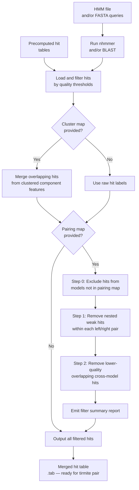

# Using tirmite search

`tirmite search` implements an **ensemble search strategy** for transposon terminal detection. It can run BLAST and/or nhmmer searches against target genomes, optionally merge overlapping hits from clustered component features, and output a filtered, merged hit table ready for `tirmite pair`.

## Processing Logic and Workflow



### Key concepts

**Ensemble search** means running multiple related HMM models or BLAST queries against the genome simultaneously. The ensemble approach is particularly useful when:

- You have multiple sub-type HMMs derived from clustering (e.g. at 80% identity)
- You want hits from all sub-types to be treated as a single logical terminus class
- You need to merge overlapping hits before pairing

**Cluster map** — a tab-delimited file that groups individual model/query names into logical clusters (e.g. all HMM sub-types for the left terminus of an element). Hits from models within the same cluster are merged if they overlap.

**Pairing map** — a tab-delimited file linking left-terminus clusters to right-terminus clusters. This is used to remove weak nested hits and to resolve competing cross-model hits at the same locus (see [Hit Filtering with a Pairing Map](#hit-filtering-with-a-pairing-map) below).

## Symmetrical vs Asymmetrical Termini

For **symmetrical elements** (TIRs, LTRs), the same model hits both ends. The cluster map maps the model to itself, and the pairing map is a self-pairing.

For **asymmetrical elements** (Helitrons, Starships), separate left and right models are used. The cluster map groups all sub-type variants for each end, and the pairing map links the left-end cluster to the right-end cluster.

## Cluster Map Format

The cluster map is a tab-delimited file mapping individual model/query names to a logical cluster name:

```
# cluster_map.txt
# model_name    cluster_name
MY_TIR_subtype1    MY_TIR
MY_TIR_subtype2    MY_TIR
MY_TIR_subtype3    MY_TIR
```

When hits are merged using the cluster map:
- Hits from all models in the same cluster are pooled
- Overlapping hits within the cluster are merged into a single hit with the cluster name as its feature label
- The highest-scoring overlapping hit's score is retained

## Pairing Map Format

The pairing map is a tab-delimited file with two columns: the left feature (cluster) name and the right feature (cluster) name:

```
# pairing_map.txt
# left_feature    right_feature
MY_TIR    MY_TIR
```

For asymmetric elements:

```
# pairing_map.txt
LEFT_TERMINUS    RIGHT_TERMINUS
```

Multiple pairs can be listed to represent several element families in one run:

```
# pairing_map.txt
FAMILY1_LEFT    FAMILY1_RIGHT
FAMILY2_LEFT    FAMILY2_RIGHT
FAMILY3_LEFT    FAMILY3_RIGHT
```

## Hit Filtering with a Pairing Map

When a pairing map is provided, `tirmite search` applies three complementary filtering steps after clustering, then emits a consolidated summary report.  All steps restrict their comparisons to models that appear in the pairing map.

### Step 0 — Exclude models not in the pairing map

Before any hit-removal logic runs, every hit whose query model is absent from both columns of the pairing map is excluded.  This ensures that unrelated models loaded from the same HMM or BLAST file cannot interfere with downstream pairing.

The excluded models and their hit counts are listed in the log.

### Step 1 — Nested hit removal within direct pairs

In asymmetric element models, the left and right terminus HMMs sometimes share a small region of homology.  This means the shorter model can produce hits that are *entirely contained* within a hit of its paired model at the same genomic locus — these are called **nested cross-hits**.

For each pair of hits on the same target sequence and strand, if:

1. Both hits come from models that form a **direct left/right pair** in the pairing map, AND
2. One hit's coordinates are completely contained within the other's (nesting),

then the nested hit is removed provided its alignment score is less than 1.5× the enclosing hit's score (configurable via `min_score_ratio`).  If the nested hit scores comparably or better, both are kept — the model may represent a genuine detection even though its hit is contained within the partner model's hit.

> **Note on models in multiple pairs.**  The pairing map is stored as a dictionary (left → right), so each left-feature name maps to exactly one right-feature partner for this filter.  If a single model must pair with multiple partners, list separate rows in the pairing map file; only the last row for a given left feature will be active for this step.  Use a cluster map to merge sub-type models before pairing rather than listing the same feature on multiple rows.

### Step 2 — Cross-model overlap filtering

Closely related transposon families often share enough sequence similarity that their respective HMM models produce hits against *both* families.  When many models from different families are searched simultaneously and their hits are assigned to pairs, lower-quality **cross-model hits** (hits from the "wrong" family's model at a given locus) must be resolved.

For every pair of hits on the same target sequence and strand that:

- Come from **different models** (both of which appear anywhere in the pairing map), AND
- Overlap by at least 1 bp,

the weaker hit is removed when the better hit's score is at least 1.5× the weaker hit's score.  When neither hit dominates by this margin, both are retained because the evidence is ambiguous.

This step is broader than Step 1 because:

- It considers *any* pair of models in the pairing map — not only directly paired left/right partners.
- It acts on *any* overlap — not only complete nesting.

Together, the three steps ensure that each genomic locus is represented by hits from only the best-matching model(s), reducing spurious downstream pair calls.

### Filter summary report

At the end of the pairing map filtering pipeline, `tirmite search` logs a structured summary report:

```
============================================================
Pairing Map Filter Summary
============================================================
Step 0 — Excluded 12 hit(s) from models not in the pairing map:
  UnrelatedModel: 12 hit(s) excluded
Step 1 — Removed 4 nested hit(s) within direct left/right pairs:
  RightA: 4 hit(s) nested within [LeftA (4)]
Step 2 — Removed 7 cross-model hit(s) at shared loci:
  FAMILY2_LEFT → FAMILY1_LEFT: 7 hit(s) removed
============================================================
```

The report includes:

| Section | Description |
|---------|-------------|
| Step 0  | Models excluded for not being in the pairing map, with per-model hit counts |
| Step 1  | Total nested hits removed per model, listing the container model(s) and counts |
| Step 2  | Cross-model overlap hits removed per model pair `(removed → winner)` |

## Example: Running with HMM queries

### Provide HMM file, let tirmite search run nhmmer

```bash
GENOME="genome.fa"
HMMFILE="MY_TIR.hmm"

tirmite search \
  --hmm-file $HMMFILE \
  --genome $GENOME \
  --outdir SEARCH_OUTPUT \
  --maxeval 0.001 \
  --mincov 0.4 \
  --threads 8
```

### Provide FASTA query, let tirmite search run BLAST

```bash
tirmite search \
  --blast-query TIR_seed.fa \
  --genome $GENOME \
  --outdir SEARCH_OUTPUT \
  --maxeval 0.001 \
  --threads 8
```

### Run both nhmmer and BLAST, merge results

```bash
tirmite search \
  --hmm-file $HMMFILE \
  --blast-query TIR_seed.fa \
  --genome $GENOME \
  --outdir SEARCH_OUTPUT \
  --maxeval 0.001 \
  --mincov 0.4 \
  --threads 8
```

## Example: Loading precomputed hits

### Load precomputed nhmmer output

```bash
tirmite search \
  --nhmmer-file precomputed_hits.tab \
  --hmm-file $HMMFILE \
  --outdir SEARCH_OUTPUT \
  --maxeval 0.001 \
  --mincov 0.4
```

### Load precomputed BLAST output

```bash
tirmite search \
  --blast-results precomputed_blast.tab \
  --query-len 100 \
  --outdir SEARCH_OUTPUT \
  --maxeval 0.001
```

## Example: Using cluster map and pairing map for multiple models

This is the primary use case for `tirmite search` when you have multiple sub-type HMMs:

```bash
# cluster_map.txt groups sub-type HMMs into logical termini
cat cluster_map.txt
# MY_TIR_subtype1    LEFT_TIR
# MY_TIR_subtype2    LEFT_TIR
# MY_TIR_subtype3    LEFT_TIR

# pairing_map.txt links left and right termini clusters
cat pairing_map.txt
# LEFT_TIR    LEFT_TIR

tirmite search \
  --hmm-file all_subtypes.hmm \
  --genome $GENOME \
  --cluster-map cluster_map.txt \
  --pairing-map pairing_map.txt \
  --outdir ENSEMBLE_OUTPUT \
  --maxeval 0.001 \
  --mincov 0.4 \
  --threads 8
```

## Understanding the `--max-offset` Option

The `--max-offset` option anchors hits within a maximum distance from the **outer edge** of a terminus model hit. This is useful for:

- Filtering out internal hits that overlap with the terminus region
- Ensuring that hits used for pairing genuinely represent the element boundary

When `--max-offset N` is set, the outer edge of each hit is determined based on its
terminus type (left/right) and strand orientation, using the same logic as `tirmite pair`:

- **Left terminus, + strand**: outer edge = model position 1 → offset = `hmmStart - 1`
- **Left terminus, - strand**: outer edge = model position `model_len` → offset = `model_len - hmmEnd`
- **Right terminus, + strand**: outer edge = model position `model_len` → offset = `model_len - hmmEnd`
- **Right terminus, - strand**: outer edge = model position 1 → offset = `hmmStart - 1`

For same-strand orientations (F,F or R,R) without a pairing map, the hit must be
within `--max-offset` bases of **both** ends of the query model.

```
Terminus hit:   |=====HIT=====|
                ^outer edge
With --max-offset 20:
Retained:       |---------20bp---------|
Discarded:      any hit starting beyond this window
```

## Split Output for Asymmetrical Models

When using `--split-paired-output` with a `--pairing-map`, left and right model hits
are written to separate output files. This is useful for asymmetrical model pairs
(e.g. Helitrons, Starships) where `tirmite pair` expects separate input files for
each terminus.

```bash
tirmite search \
  --hmm left_model.hmm right_model.hmm \
  --genome $GENOME \
  --pairing-map pairing_map.txt \
  --split-paired-output \
  --outdir SEARCH_OUTPUT
```

This produces:

- `<prefix>_left_hits.tab` — hits from left-column models in the pairing map
- `<prefix>_right_hits.tab` — hits from right-column models in the pairing map
- `<prefix>_hits.tab` — all hits (always written)

!!! warning "Model name uniqueness"
    When `--split-paired-output` is enabled, each model name must appear exclusively
    in either the left or right column of the pairing map. Models appearing in both
    columns will cause an error.

## Output Files

| File | Description |
|------|-------------|
| `<prefix>_hits.tab` | Merged, filtered hit table (BLAST tabular format) ready for `tirmite pair` |
| `<prefix>_left_hits.tab` | Left model hits only (when `--split-paired-output` is used) |
| `<prefix>_right_hits.tab` | Right model hits only (when `--split-paired-output` is used) |

## Next Steps

Pass the merged hit table to `tirmite pair`:

→ **[Using tirmite pair](tirmite-pair.md)**

For **symmetrical** models (single model for both termini):

```bash
tirmite pair \
  --genome $GENOME \
  --blast-file ENSEMBLE_OUTPUT/<prefix>_hits.tab \
  --pairing-map pairing_map.txt \
  --orientation F,R \
  --mincov 0.4 \
  --maxdist 20000 \
  --outdir PAIR_OUTPUT \
  --gff
```

For **asymmetrical** models (separate left and right models), use the split output files:

```bash
tirmite pair \
  --genome $GENOME \
  --left-hits SEARCH_OUTPUT/<prefix>_left_hits.tab \
  --right-hits SEARCH_OUTPUT/<prefix>_right_hits.tab \
  --pairing-map pairing_map.txt \
  --orientation F,R \
  --maxdist 20000 \
  --outdir PAIR_OUTPUT \
  --gff
```
