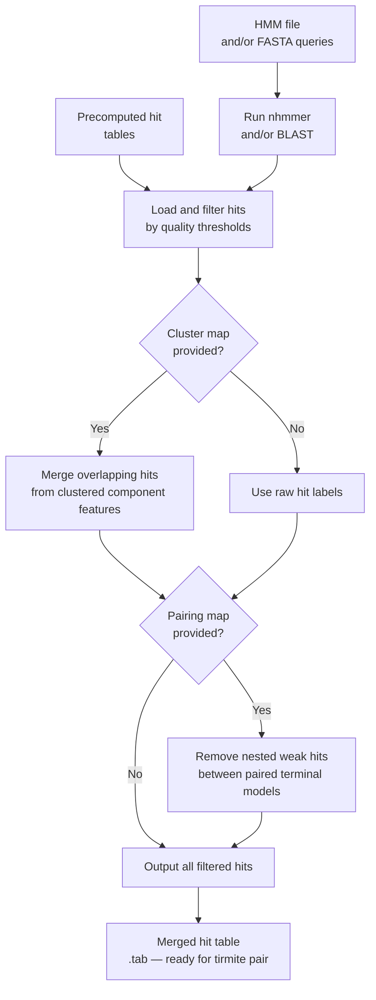

# Using tirmite search

`tirmite search` implements an **ensemble search strategy** for transposon terminal detection. It can run BLAST and/or nhmmer searches against target genomes, optionally merge overlapping hits from clustered component features, and output a filtered, merged hit table ready for `tirmite pair`.

## Processing Logic and Workflow



### Key concepts

**Ensemble search** means running multiple related HMM models or BLAST queries against the genome simultaneously. The ensemble approach is particularly useful when:

- You have multiple sub-type HMMs derived from clustering (e.g. at 80% identity)
- You want hits from all sub-types to be treated as a single logical terminus class
- You need to merge overlapping hits before pairing

**Cluster map** — a tab-delimited file that groups individual model/query names into logical clusters (e.g. all HMM sub-types for the left terminus of an element). Hits from models within the same cluster are merged if they overlap.

**Pairing map** — a tab-delimited file linking left-terminus clusters to right-terminus clusters. This is used to remove weak nested hits: if a hit from the "left" model overlaps with a hit from the "right" model, the weaker one is removed.

## Symmetrical vs Asymmetrical Termini

For **symmetrical elements** (TIRs, LTRs), the same model hits both ends. The cluster map maps the model to itself, and the pairing map is a self-pairing.

For **asymmetrical elements** (Helitrons, Starships), separate left and right models are used. The cluster map groups all sub-type variants for each end, and the pairing map links the left-end cluster to the right-end cluster.

## Cluster Map Format

The cluster map is a tab-delimited file mapping individual model/query names to a logical cluster name:

```
# cluster_map.txt
# model_name    cluster_name
MY_TIR_subtype1    MY_TIR
MY_TIR_subtype2    MY_TIR
MY_TIR_subtype3    MY_TIR
```

When hits are merged using the cluster map:
- Hits from all models in the same cluster are pooled
- Overlapping hits within the cluster are merged into a single hit with the cluster name as its feature label
- The highest-scoring overlapping hit's score is retained

## Pairing Map Format

The pairing map is a tab-delimited file with two columns: the left feature (cluster) name and the right feature (cluster) name:

```
# pairing_map.txt
# left_feature    right_feature
MY_TIR    MY_TIR
```

For asymmetric elements:

```
# pairing_map.txt
LEFT_TERMINUS    RIGHT_TERMINUS
```

## Example: Running with HMM queries

### Provide HMM file, let tirmite search run nhmmer

```bash
GENOME="genome.fa"
HMMFILE="MY_TIR.hmm"

tirmite search \
  --hmm-file $HMMFILE \
  --genome $GENOME \
  --outdir SEARCH_OUTPUT \
  --maxeval 0.001 \
  --mincov 0.4 \
  --threads 8
```

### Provide FASTA query, let tirmite search run BLAST

```bash
tirmite search \
  --blast-query TIR_seed.fa \
  --genome $GENOME \
  --outdir SEARCH_OUTPUT \
  --maxeval 0.001 \
  --threads 8
```

### Run both nhmmer and BLAST, merge results

```bash
tirmite search \
  --hmm-file $HMMFILE \
  --blast-query TIR_seed.fa \
  --genome $GENOME \
  --outdir SEARCH_OUTPUT \
  --maxeval 0.001 \
  --mincov 0.4 \
  --threads 8
```

## Example: Loading precomputed hits

### Load precomputed nhmmer output

```bash
tirmite search \
  --nhmmer-file precomputed_hits.tab \
  --hmm-file $HMMFILE \
  --outdir SEARCH_OUTPUT \
  --maxeval 0.001 \
  --mincov 0.4
```

### Load precomputed BLAST output

```bash
tirmite search \
  --blast-results precomputed_blast.tab \
  --query-len 100 \
  --outdir SEARCH_OUTPUT \
  --maxeval 0.001
```

## Example: Using cluster map and pairing map for multiple models

This is the primary use case for `tirmite search` when you have multiple sub-type HMMs:

```bash
# cluster_map.txt groups sub-type HMMs into logical termini
cat cluster_map.txt
# MY_TIR_subtype1    LEFT_TIR
# MY_TIR_subtype2    LEFT_TIR
# MY_TIR_subtype3    LEFT_TIR

# pairing_map.txt links left and right termini clusters
cat pairing_map.txt
# LEFT_TIR    LEFT_TIR

tirmite search \
  --hmm-file all_subtypes.hmm \
  --genome $GENOME \
  --cluster-map cluster_map.txt \
  --pairing-map pairing_map.txt \
  --outdir ENSEMBLE_OUTPUT \
  --maxeval 0.001 \
  --mincov 0.4 \
  --threads 8
```

## Understanding the `--max-offset` Option

The `--max-offset` option anchors hits within a maximum distance from the **outer edge** of a terminus model hit. This is useful for:

- Filtering out internal hits that overlap with the terminus region
- Ensuring that hits used for pairing genuinely represent the element boundary

When `--max-offset N` is set, only hits whose start position (on the positive strand) is within N bp of the outermost edge of the top-scoring hit for that terminus are retained.

```
Terminus hit:   |=====HIT=====|
                ^outer edge
With --max-offset 20:
Retained:       |---------20bp---------|
Discarded:      any hit starting beyond this window
```

## Output Files

| File | Description |
|------|-------------|
| `<outname>_merged_hits.tab` | Merged, filtered hit table (BLAST tabular format) ready for `tirmite pair` |
| `<outname>_raw_hits.tab` | Raw hits before merging (if saved) |

## Next Steps

Pass the merged hit table to `tirmite pair`:

→ **[Using tirmite pair](tirmite-pair.md)**

```bash
tirmite pair \
  --genome $GENOME \
  --blast-file ENSEMBLE_OUTPUT/<outname>_merged_hits.tab \
  --pairing-map pairing_map.txt \
  --orientation F,R \
  --mincov 0.4 \
  --maxdist 20000 \
  --outdir PAIR_OUTPUT \
  --gff-out
```
