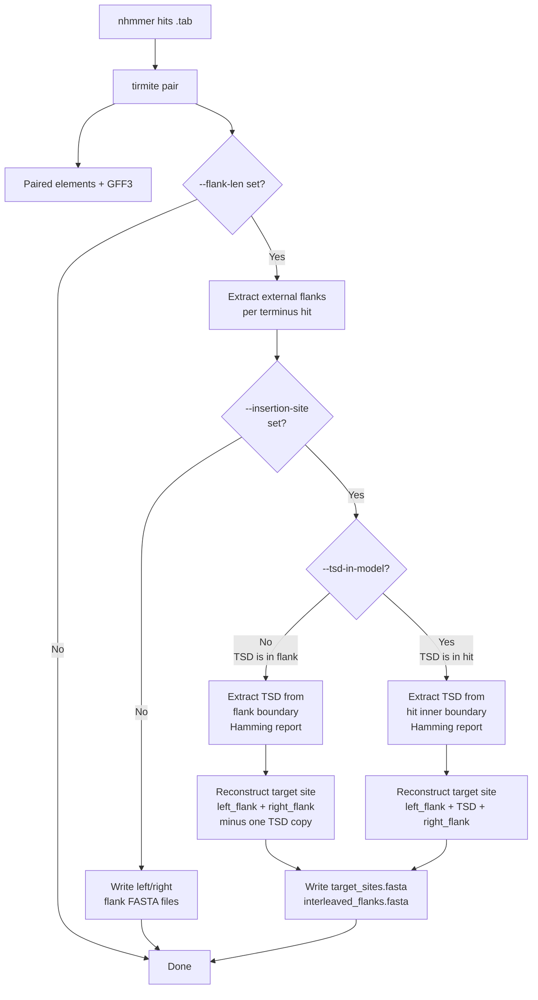
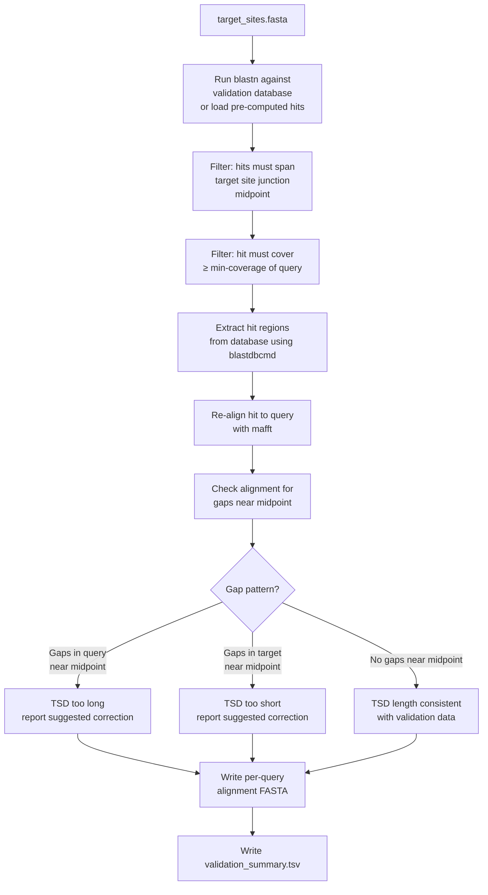

# Reconstructing and Validating Target Sites

This tutorial walks through the full workflow for:

1. Using `tirmite pair` to reconstruct the original target site from paired terminus hits.
2. Using `tirmite validate` to confirm those reconstructions by searching a reference genome database for matching empty insertion sites.

## Background

When a DNA transposon inserts into a genome, the host machinery duplicates a short sequence at the insertion site — the **Target Site Duplication (TSD)** or **Direct Repeat (DR)**. After insertion, one copy of this feature flanks each end of the element:

```
Before insertion:  ←flank← [TSD] →flank→
After insertion:   ←flank← [TSD][LEFT_TERMINUS]…[RIGHT_TERMINUS][TSD] →flank→
```

TIRmite can reconstruct the original (pre-insertion) target site by joining the external flanks and removing the duplicate TSD copy. This reconstructed target site can then be used to search for **empty insertion sites** — genomic positions where no element is present but the TSD context is intact. Empty sites serve as independent evidence that the predicted element boundaries and TSD length are correct.

---

## Part 1: Extracting Flanks and Reconstructing Target Sites

### Step 1: Run nhmmer to locate terminus hits

```bash
GENOME="genome.fa"
HMMFILE="MY_TIR.hmm"
NHMMERFILE="MY_TIR_nhmmer_hits.tab"

nhmmer --dna --cpu 8 --tblout $NHMMERFILE $HMMFILE $GENOME
```

### Step 2: Run `tirmite pair` with target site reconstruction

Use `--flank-len` to extract flanking sequence and `--insertion-site` to enable target site reconstruction.  Set `--tsd-length` to specify the TSD length and add `--tsd-in-model` if the TSD is encoded at the inner end of your terminus HMM model.

#### Case A: TSD is outside the termini model (TSD is in the flank)

The TSD appears as the innermost `n` bases of each extracted flank, immediately adjacent to the terminus hit boundary.

```
genome: ←[left_flank][TSD]→[LEFT_HIT]…[RIGHT_HIT]←[TSD][right_flank]→
```

```bash
tirmite pair \
  --genome $GENOME \
  --nhmmer-file $NHMMERFILE \
  --hmm-file $HMMFILE \
  --orientation F,R \
  --mincov 0.4 \
  --maxdist 20000 \
  --flank-len 30 \
  --insertion-site \
  --tsd-length 8 \
  --outdir TIR_OUTPUT \
  --gff-out
```

#### Case B: TSD is part of the termini model (TSD is inside the hit)

The TSD is modelled at the inner end of each terminus HMM.  Pass `--tsd-in-model` so TIRmite extracts the TSD from the hit's inner boundary rather than from the external flank.

```
genome: ←[left_flank]→[LEFT_HIT][TSD]…[TSD][RIGHT_HIT]←[right_flank]→
```

```bash
tirmite pair \
  --genome $GENOME \
  --nhmmer-file $NHMMERFILE \
  --hmm-file $HMMFILE \
  --orientation F,R \
  --mincov 0.4 \
  --maxdist 20000 \
  --flank-len 30 \
  --insertion-site \
  --tsd-length 8 \
  --tsd-in-model \
  --outdir TIR_OUTPUT \
  --gff-out
```

#### Using a TSD length map for multiple model pairs

When processing hits from multiple terminus models (via `--pairing-map`), provide a per-pair TSD length map instead of a single `--tsd-length` value.

```bash
# tsd_lengths.tsv
# left_model    right_model   tsd_length
LEFT_TIR        RIGHT_TIR     8
ITR_5prime      ITR_3prime    5
```

```bash
tirmite pair \
  --genome $GENOME \
  --nhmmer-file multi_model_hits.tab \
  --lengths-file model_lengths.txt \
  --pairing-map pairing_map.txt \
  --orientation F,R \
  --mincov 0.4 \
  --maxdist 20000 \
  --flank-len 30 \
  --insertion-site \
  --tsd-length-map tsd_lengths.tsv \
  --outdir TIR_OUTPUT \
  --gff-out
```

### Target site reconstruction output files

When `--insertion-site` is set alongside `--flank-len`, `tirmite pair` writes two additional FASTA files:

| File | Contents |
|------|----------|
| `{prefix}target_sites.fasta` | Reconstructed target sites — one per paired element |
| `{prefix}interleaved_flanks.fasta` | Interleaved left/right flanks showing TSD overlap position |

#### Reconstructed target site FASTA header format

Each target site entry includes rich metadata:

```
>MY_TIR_1 flank_len=30 tsd_len=8 tsd_in_model=False left_model=MY_TIR right_model=MY_TIR contig=chr1 left_flank_hit=+:1000_1050 right_flank_hit=-:2100_2150 tsd_hamming=0 left_tsd=ATCGATCG right_tsd=ATCGATCG
```

| Tag | Description |
|-----|-------------|
| `flank_len` | Length of flanking region extracted (bp) |
| `tsd_len` | User-specified TSD length |
| `tsd_in_model` | Whether TSD is inside the terminus model |
| `left_model` / `right_model` | Names of the paired terminus models |
| `contig` | Genome sequence ID containing the element |
| `left_flank_hit` | Strand and coordinates of the left terminus hit |
| `right_flank_hit` | Strand and coordinates of the right terminus hit |
| `tsd_hamming` | Hamming distance between left and right TSD copies |
| `left_tsd` / `right_tsd` | Extracted TSD sequences (reported when > 0 bp) |

#### Interleaved flanks FASTA

The interleaved file shows the TSD overlap between the two flanks:

```
>MY_TIR_1_left  …
AAAAAAAAAA ATCGATCG --------
>MY_TIR_1_right …
---------- ATCGATCG CCCCCCCCCC
```

The left flank is right-padded with gaps to align with the right flank, and the TSD region overlaps in the middle.

### Workflow overview



---

## Part 2: Validating Reconstructed Target Sites

`tirmite validate` takes the reconstructed target sites from `tirmite pair` and searches a reference genome database for empty insertion sites — positions in the genome where no element is present but the TSD context is intact.

### Prerequisites

You need:

- The `target_sites.fasta` file produced by `tirmite pair`.
- A BLAST nucleotide database for the validation genome (or a large reference genome collection).

```bash
# Build a BLAST database from your reference genome
makeblastdb -in reference_genome.fa -dbtype nucl -out reference_db -parse_seqids
```

### Step 3: Run `tirmite validate`

```bash
tirmite validate \
  --target-sites TIR_OUTPUT/target_sites.fasta \
  --blastdb reference_db \
  --tsd-length 8 \
  --min-coverage 0.95 \
  --outdir VALIDATE_OUTPUT \
  --prefix MY_TIR
```

### Using pre-computed BLAST results

If you already have BLAST results (for example, from a previous run), pass them with `--blast-results` to skip re-running BLAST. The expected format is BLAST outfmt 6 with the additional `qlen`, `slen`, and `sstrand` columns:

```bash
blastn \
  -query TIR_OUTPUT/target_sites.fasta \
  -db reference_db \
  -outfmt "6 qseqid sseqid pident length mismatch gapopen qstart qend sstart send evalue bitscore qlen slen sstrand" \
  -out my_blast_results.tab \
  -evalue 1e-5

tirmite validate \
  --target-sites TIR_OUTPUT/target_sites.fasta \
  --blastdb reference_db \
  --blast-results my_blast_results.tab \
  --tsd-length 8 \
  --min-coverage 0.95 \
  --outdir VALIDATE_OUTPUT \
  --prefix MY_TIR
```

### How validation works



#### Junction-spanning filter

A hit must span the **midpoint** of the reconstructed target site (the junction between left and right flanks). This ensures we are looking at the original insertion position.

For a reconstructed target site of total length `L`, the midpoint is at position `L // 2`. Hits whose alignment does not cross this position are discarded.

#### Coverage filter

Only hits covering at least `--min-coverage` (default 95%) of the query length are retained. This removes partial matches that may not represent true empty sites.

#### TSD length validation from alignment gaps

After re-aligning each hit to the query, TIRmite inspects the alignment around the midpoint for gaps:

- **Gaps in the query** near the midpoint → the TSD length is too long; the reconstruction has extra sequence that is absent from the true empty site.
- **Gaps in the target** near the midpoint → the TSD length is too short; the reconstruction is missing sequence that is present in the empty site.
- **No gaps near the midpoint** → the TSD length appears correct.

### Validation output files

| File | Contents |
|------|----------|
| `{prefix}validation_summary.tsv` | Per-element summary: hit counts, TSD error estimates |
| `{prefix}{query_id}_alignment.fasta` | MAFFT alignment of query + passing hits (per query) |

#### Validation summary columns

| Column | Description |
|--------|-------------|
| `query_id` | Target site sequence ID |
| `total_hits` | Number of BLAST hits before filtering |
| `junction_spanning_hits` | Hits passing the junction-spanning filter |
| `coverage_filtered_hits` | Hits also passing the coverage filter |
| `tsd_length` | User-specified TSD length |
| `tsd_error` | Estimated error in TSD length (negative = too long; positive = too short) |
| `tsd_message` | Human-readable message about TSD length consistency |

### Full example: from search to validation

```bash
# 1. Build HMM model (if not already available)
tirmite seed \
  --left-seed TIR_seed.fa \
  --model-name MY_TIR \
  --genome genome.fa \
  --outdir HMM_OUTPUT

# 2. Search genome with nhmmer
GENOME="genome.fa"
HMMFILE="HMM_OUTPUT/MY_TIR.hmm"
nhmmer --dna --cpu 8 --tblout MY_TIR_hits.tab $HMMFILE $GENOME

# 3. Pair hits and reconstruct target sites
tirmite pair \
  --genome $GENOME \
  --nhmmer-file MY_TIR_hits.tab \
  --hmm-file $HMMFILE \
  --orientation F,R \
  --mincov 0.4 \
  --maxdist 20000 \
  --flank-len 30 \
  --insertion-site \
  --tsd-length 8 \
  --outdir PAIR_OUTPUT \
  --gff-out

# 4. Build validation BLAST database from a large reference
makeblastdb -in reference.fa -dbtype nucl -out ref_db -parse_seqids

# 5. Validate reconstructed target sites
tirmite validate \
  --target-sites PAIR_OUTPUT/target_sites.fasta \
  --blastdb ref_db \
  --tsd-length 8 \
  --min-coverage 0.95 \
  --outdir VALIDATE_OUTPUT \
  --prefix MY_TIR
```

## Key Options Reference

### `tirmite pair` — target site reconstruction options

| Option | Description |
|--------|-------------|
| `--flanks` | Enable writing of external flanking sequences for all hits |
| `--flanks-paired` | Write outer flanking sequences for paired termini only |
| `--flank-len N` | Extract N bp of external flanking sequence per terminus (default: 50) |
| `--flank-max-offset N` | Skip flanks for hits where alignment offset from model edge exceeds N bp |
| `--insertion-site` | Enable insertion site reconstruction and reporting (requires `--flanks` or `--flanks-paired`) |
| `--tsd-length N` | Length of TSD/DR feature (bp) for a single model pair (requires `--insertion-site`) |
| `--tsd-length-map FILE` | Tab-delimited file mapping model pairs to TSD lengths (requires `--insertion-site`) |
| `--tsd-in-model` | The TSD is encoded at the inner end of the terminus HMM model |

### `tirmite validate` options

| Option | Description |
|--------|-------------|
| `--target-sites FILE` | Reconstructed target site FASTA from `tirmite pair` |
| `--blastdb PATH` | BLAST database for validation searches |
| `--blast-results FILE` | Pre-computed BLAST results (outfmt 6 + qlen/slen/sstrand columns) |
| `--min-coverage FLOAT` | Minimum fraction of query covered by hit (default: 0.95) |
| `--evalue FLOAT` | E-value threshold for BLAST searches (default: 1e-5) |
| `--tsd-length N` | Default TSD length for validation |
| `--tsd-length-map FILE` | Per-pair TSD length map (same format as `tirmite pair`) |
| `--tsd-in-model` | The TSD is inside the terminus model |
| `--outdir DIR` | Directory for output files |
| `--prefix STR` | Prefix for output filenames |
